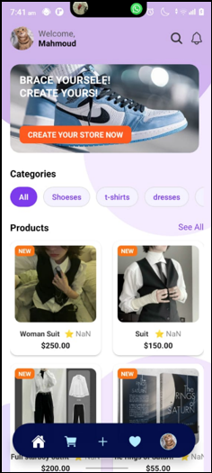
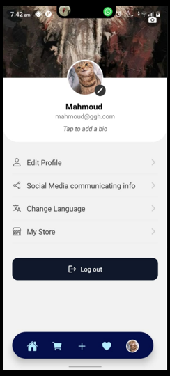
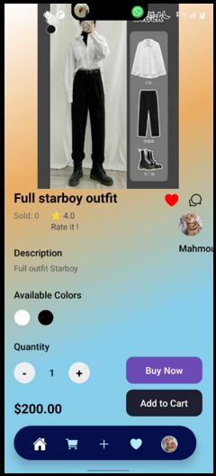

# SalesLeader

Modern e-commerce marketplace application built with React Native, Expo, Firebase, and TypeScript.

Designed with scalable architecture, real-time synchronization, and highly animated UI/UX systems.

---
# SalesLeader

## Screenshots

### Home Screen                            Profile Screen                               Product Screen
                


there are more in the screenshot folder for more refrence
## Features

- Multi-store marketplace system
- Product publishing system
- Real-time notifications
- Authentication system
- Dynamic user profiles
- Favorites system
- Cart management
- Animated custom tab bar
- Product categories & filtering
- Search system
- Persistent local storage
- Firebase cloud backend
- Multi-language support (Arabic / English)
- Responsive mobile-first UI
- Skeleton loading states
- Smooth scroll animations
- Store creation system
- Real-time Firestore synchronization

---

## Tech Stack

### Frontend
- React Native
- Expo
- TypeScript
- React Navigation
- React Native Reanimated
- Expo Image
- AsyncStorage
- Native Animations

### Backend / Cloud
- Firebase Authentication
- Firestore Database
- Firebase Storage

### UI / UX
- Custom Animated Tab Bar
- Skeleton Loading
- Dynamic Gradient Backgrounds
- Responsive Product Grid
- Real-Time Notification Badges

---

## Architecture

User Authentication → Firestore Sync → Product System → Real-Time Notifications → Marketplace Experience

---

## Main Systems

### Authentication
Firebase Authentication system with persistent login state management.

### Marketplace
Users can create stores, upload products, and manage listings.

### Real-Time Notifications
Live Firestore listeners provide instant notification updates.

### Product Management
Products are globally stored and linked to users through references.

### Localization
Supports Arabic and English using i18n.

### UI Experience
Highly animated and optimized mobile-first experience with custom navigation and transitions.

---

## Run Locally

### Install dependencies

```bash
npm install
